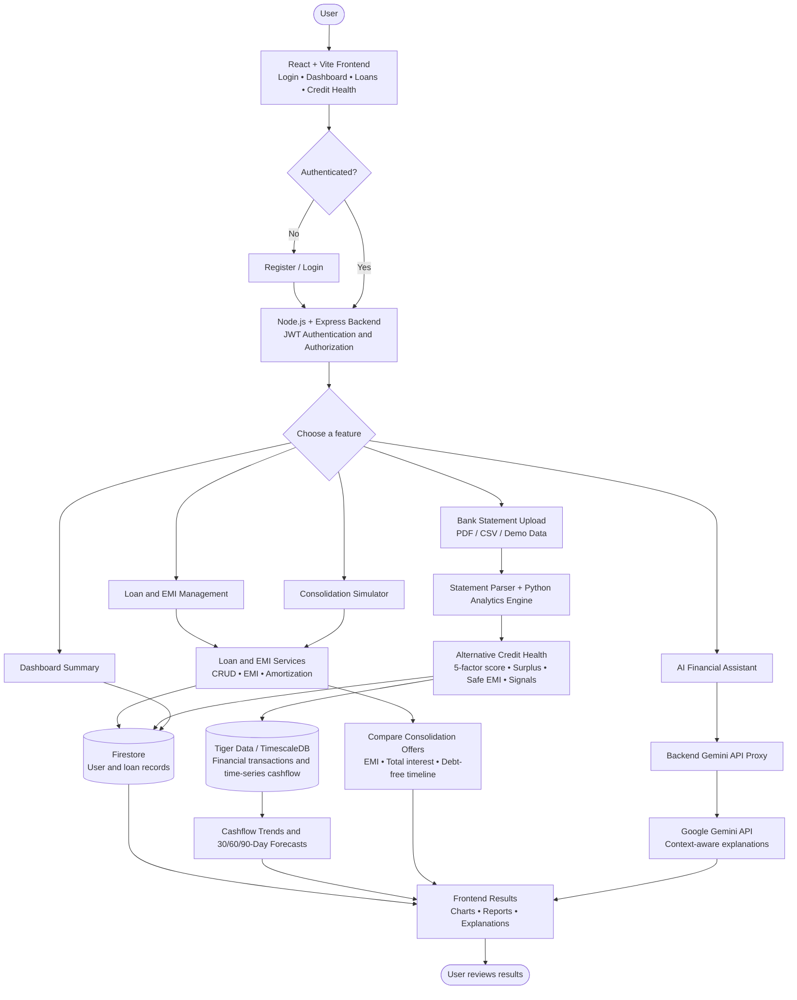

# CrediMerge — System Flowchart

This diagram summarizes the main user journey and architecture documented in the project README. It is an architecture overview; verify service and database wiring against the deployed configuration.

**Security boundary:** The frontend calls the Express API. Keep database connection strings and Gemini credentials server-side; enforce JWT authorization and user-scoped data access on every private endpoint.
